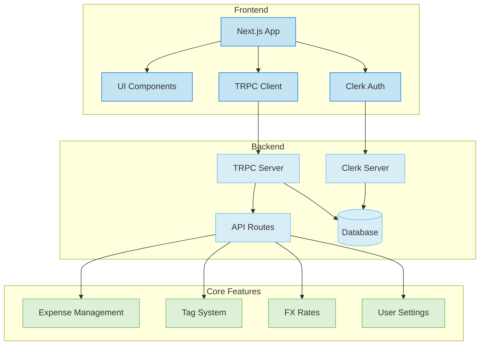

```mermaid
flowchart TB
    subgraph "Frontend"
        NextJS[Next.js App]
        UI[UI Components]
        TRPC[TRPC Client]
        Clerk[Clerk Auth]
    end

    subgraph "Backend"
        API[API Routes]
        TRPCServer[TRPC Server]
        DB[(Database)]
        ClerkServer[Clerk Server]
    end

    subgraph "Core Features"
        Expenses[Expense Management]
        Tags[Tag System]
        FX[FX Rates]
        User[User Settings]
    end

    NextJS --> UI
    NextJS --> TRPC
    NextJS --> Clerk

    TRPC --> TRPCServer
    Clerk --> ClerkServer

    TRPCServer --> API
    TRPCServer --> DB
    ClerkServer --> DB

    API --> Expenses
    API --> Tags
    API --> FX
    API --> User

    classDef frontend fill:#c4e3f3,stroke:#0275d8
    classDef backend fill:#d9edf7,stroke:#5bc0de
    classDef features fill:#dff0d8,stroke:#5cb85c
    
    class NextJS,UI,TRPC,Clerk frontend
    class API,TRPCServer,DB,ClerkServer backend
    class Expenses,Tags,FX,User features
```