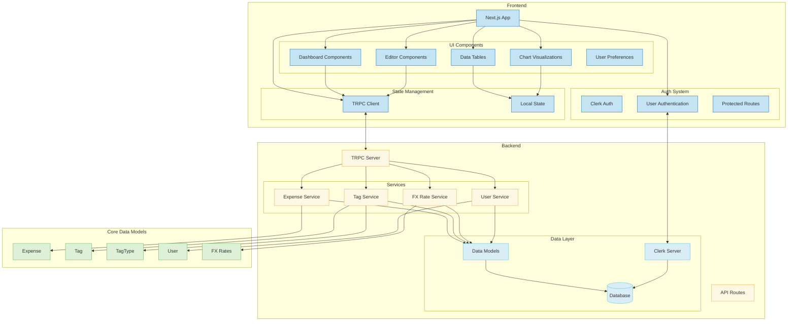
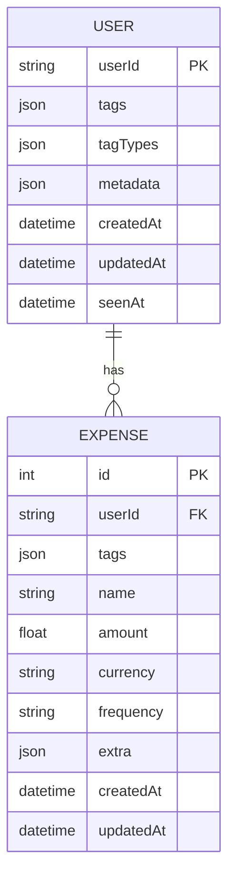
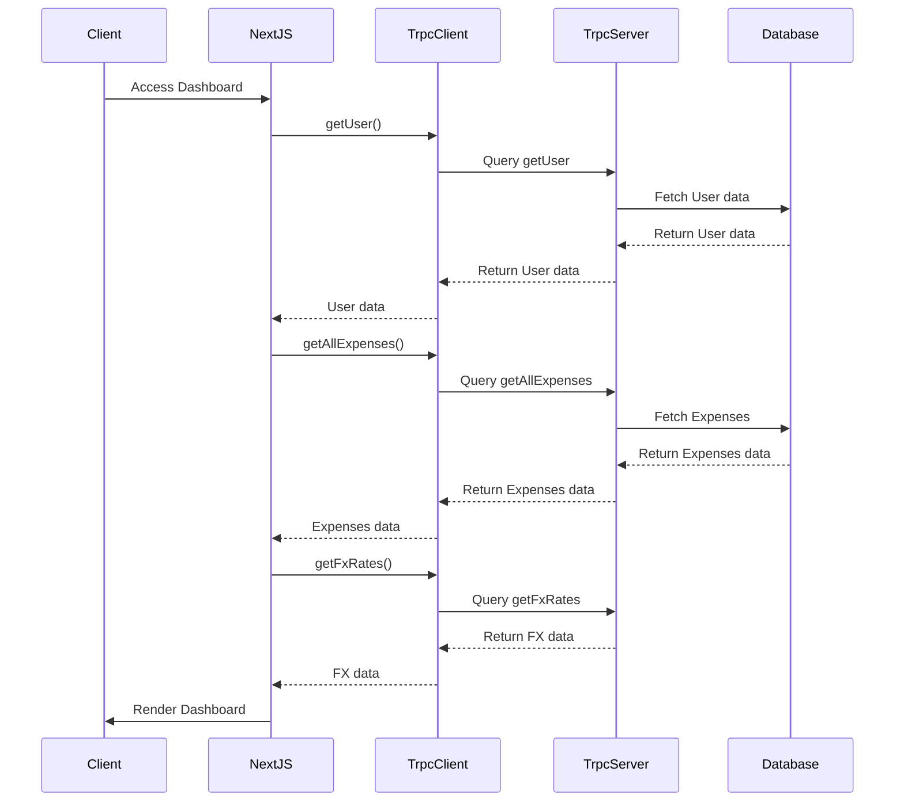
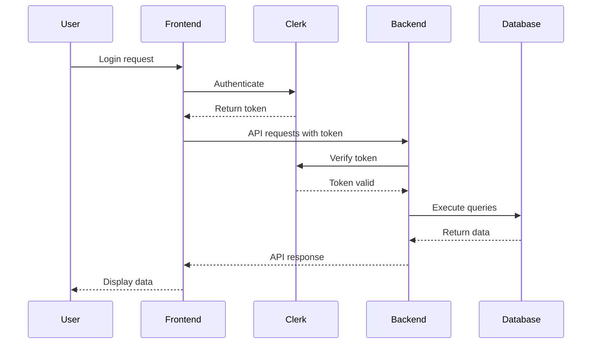

# Recspenses: Expense Management System Schema

## System Architecture



## Data Models

### Core Types

#### User

```typescript
type DBUser = {
  userId: string
  tags: DBTag[]         // Stored as JSON in DB
  tagTypes: TagType[]   // Stored as JSON in DB
  metadata: Record<string, unknown>
  createdAt: Date
  updatedAt: Date | null
  seenAt: Date | null
}

class User implements PlainObjectConvertible {
  userId: string
  tags: Tag[]
  tagTypes: TagType[]
  metadata: Record<string, unknown>
  createdAt: Date
  updatedAt: Date | null
  seenAt: Date | null
  
  constructor(dbUser: DBUser)
  toPlainObject(): Record<string, any>
}
```

#### Expense

```typescript
type DBExpense = {
  id?: number
  userId: string
  tags: string[]        // Stored as JSON in DB
  name: string
  amount: number
  currency: CURRENCY
  frequency: FREQUENCY
  extra: Record<string, unknown>  // Stored as JSON in DB
  createdAt: Date
  updatedAt: Date
}

type ExpensePlainObject = {
  id?: number
  userId: string
  tags: any[]
  name: string
  amount: number
  currency: CURRENCY
  frequency: FREQUENCY
  extra: Record<string, unknown>
  createdAt: string | Date
  updatedAt: string | Date
}

class Expense implements PlainObjectConvertible {
  id?: number
  userId: string
  tags: Tag[]
  name: string
  amount: number
  currency: CURRENCY
  frequency: FREQUENCY
  extra: Record<string, unknown>
  createdAt: Date
  updatedAt: Date
  
  constructor(user: User, dbExpense: DBExpense)
  toPlainObject(): ExpensePlainObject
}
```

#### Tag

```typescript
type DBTag = {
  id: string
  name: string
  description: string
  color: string
  type: string  // Reference to TagType id
}

class Tag implements PlainObjectConvertible {
  id: string
  name: string
  description: string
  color: string
  type: TagType
  
  constructor(id: string, name: string, description: string, color: string, type: TagType)
  static buildWithUnknownId(id: string): Tag
  toPlainObject(): Record<string, any>
}
```

#### TagType

```typescript
class TagType {
  id: string
  name: string
  description: string
  color: string
  
  constructor(id: string, name: string, description: string, color: string)
  static buildWithUnknownId(id: string): TagType
}
```

### Enums and Constants

```typescript
type CURRENCY = "GBP" | "USD" | "EUR" | "RON"
type FREQUENCY = "daily" | "weekly" | "monthly" | "yearly"

const CURRENCIES: CURRENCY[] = ["GBP", "USD", "EUR", "RON"] as const
const FREQUENCIES: FREQUENCY[] = ["daily", "weekly", "monthly", "yearly"] as const
```

### Dashboard Data

```typescript
class DashboardData {
  fxData: FxRateData
  displayCurrency: CURRENCY
  displayFrequency: FREQUENCY
  expenses: DashboardExpense[]
  
  constructor(fxData: FxRateData, displayCurrency: CURRENCY, displayFrequency: FREQUENCY)
  add(expenses: ExpensePlainObject[])
  getAllExpenses(): DashboardExpense[]
}

type DashboardExpense = ExpensePlainObject & {
  original: number
  transformed: number
}

type FxRateData = {
  base: string
  rates: Record<string, number>
  date: string
}
```

## Components

### Data Tables

#### DataTable

```typescript
interface DataTableProps {
  columns: ColumnDef<Record<string, any>, any>[]
  data: Array<ReturnType<typeof Expense.prototype.toPlainObject>>
  user: ReturnType<typeof User.prototype.toPlainObject>
}

function DataTable({ columns, data, user }: DataTableProps)
```

### Dashboard Components

#### ComponentDashboard

```typescript
interface ComponentDashboardProps {
  plainExpenses: Record<string, unknown>[]
  fxData: FxRateData
  plainUser: Record<string, unknown>
}

function ComponentDashboard({ plainExpenses, fxData, plainUser }: ComponentDashboardProps)
```

#### ComponentChart

```typescript
function ComponentChart({
  data,
  plainUser,
  displayOthers = true,
}: {
  data: DashboardExpense[]
  plainUser: Record<string, unknown>
  displayOthers?: boolean
})
```

#### ComponentCardSettings

```typescript
function ComponentCardSettings({
  metadata,
  onCurrencyChange,
  onFrequencyChange,
  onDisplayOthersChange,
}: {
  metadata: Record<string, unknown>
  onCurrencyChange: (currency: CURRENCY) => void
  onFrequencyChange: (frequency: FREQUENCY) => void
  onDisplayOthersChange: (display: boolean) => void
})
```

### Editor Components

#### ComponentDialogEdit

```typescript
function ComponentDialogEdit({
  row,
  user,
}: {
  row: ExpensePlainObject
  user: ReturnType<typeof User.prototype.toPlainObject>
})
```

#### ComponentDialogDelete

```typescript
function ComponentDialogDelete({
  row,
}: {
  row: ExpensePlainObject
})
```

#### ComponentTableRowNew

```typescript
function ComponentTableRowNew()
```

## API Routes

### tRPC Routes

#### Expense Routes

```typescript
// User related routes
router.query("getUser", { ... })
router.mutation("updateUser", { ... })

// Expense related routes
router.query("getAllExpenses", { ... })
router.query("getExpenseById", { ... })
router.mutation("createExpense", { ... })
router.mutation("updateExpense", { ... })
router.mutation("deleteExpense", { ... })

// Tag related routes
router.query("getAllTags", { ... })
router.mutation("createTag", { ... })
router.mutation("updateTag", { ... })
router.mutation("deleteTag", { ... })

// TagType related routes
router.query("getAllTagTypes", { ... })
router.mutation("createTagType", { ... })
router.mutation("updateTagType", { ... })
router.mutation("deleteTagType", { ... })

// FX related routes
router.query("getFxRates", { ... })
```

## Database Schema



## Data Flow



## Authentication Flow

